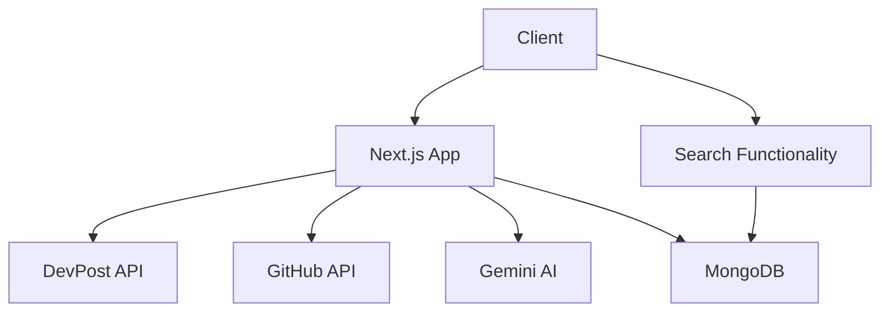

# Architecture Documentation

## System Overview

This project is a Next.js application that analyzes DevPost projects and their associated GitHub repositories using AI-powered analysis.



## Core Components

### 1. Frontend Layer

-   Next.js App Router
-   React Components
-   TailwindCSS for styling

### 2. API Layer

-   `/api/devpost`: DevPost project analysis endpoint
-   `/api/projects/search`: Project search and filtering endpoint
-   GitHub repository analysis service
-   Gemini AI integration for technical analysis

### 3. Data Layer

-   MongoDB for data persistence
-   Caching layer for analyzed projects
-   Search indexes for efficient querying

## Data Flow

1. **Project Analysis Request**

    ```mermaid
    sequenceDiagram
        Client->>API: POST /api/devpost
        API->>MongoDB: Check Cache
        MongoDB-->>API: Return Cached Data
        API->>DevPost: Scrape Project
        DevPost-->>API: Project Data
        API->>GitHub: Analyze Repo
        GitHub-->>API: Repo Content
        API->>Gemini: Analyze Content
        Gemini-->>API: Technical Analysis
        API->>MongoDB: Save Results
        API-->>Client: Return Analysis
    ```

2. **Project Search Flow**
    ```mermaid
    sequenceDiagram
        Client->>SearchPage: Request with Params
        SearchPage->>MongoDB: Query Projects
        MongoDB-->>SearchPage: Return Matches
        SearchPage->>Client: Render Results
        Client->>SearchPage: Pagination/Filter
        SearchPage->>MongoDB: Updated Query
        MongoDB-->>SearchPage: New Results
        SearchPage->>Client: Updated Content
    ```

## Key Services

### DevPost Service

-   Handles DevPost project data scraping
-   Extracts GitHub repository links
-   Processes project information

### GitHub Analysis Service

-   Fetches repository content
-   Analyzes code structure
-   Extracts technical details

### AI Analysis Service

-   Processes repository content
-   Generates technical insights
-   Provides improvement suggestions

### Search Service

-   Processes search queries
-   Filters projects by criteria
-   Handles pagination
-   Provides relevancy scoring

## Error Handling

The system implements robust error handling:

-   Rate limiting protection
-   Fallback mechanisms
-   Graceful degradation
-   Retry mechanisms for transient failures

## Security

-   Environment-based configuration
-   API key management
-   Request validation
-   Error sanitization

## Performance Considerations

-   Response caching
-   Parallel processing
-   Efficient data fetching
-   Resource optimization
-   MongoDB indexes for search performance

## Monitoring and Logging

The system logs important events:

-   API requests and responses
-   Analysis operations
-   Error conditions
-   Performance metrics
