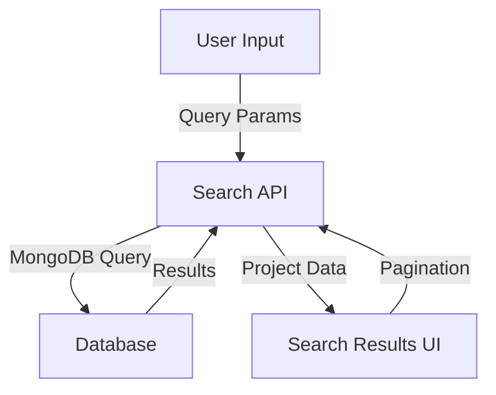

# Search Functionality

This document describes the search feature that allows users to find and filter projects.

## Overview

The search functionality enables users to find projects by keywords, filter by technology, and navigate through paginated results. It's implemented as a combination of server and client components for optimal performance and user experience.



## Components

### 1. Search Page

-   Located at `/app/search/page.tsx`
-   Server component that handles data fetching based on URL parameters
-   Renders search UI, results, and provides pagination

### 2. Search API

-   Located at `/app/api/projects/search/route.ts`
-   Handles search queries with parameters:
    -   `query`: General search term (searches titles, descriptions, and summaries)
    -   `tech`: Technology filter (searches tech stack)
    -   `page`: Pagination control
    -   `limit`: Results per page

### 3. UI Components

-   `SearchBar`: Client component for search input and filtering
-   `Pagination`: Client component for navigating between result pages
-   `ProjectCard`: Displays individual project information in search results

## URL Query Parameters

The search functionality uses URL parameters for state management:

| Parameter | Description                             | Example             |
| --------- | --------------------------------------- | ------------------- |
| `query`   | General search term                     | `?query=blockchain` |
| `tech`    | Filter by specific technology           | `?tech=react`       |
| `page`    | Current page number (default: 1)        | `?page=2`           |
| `limit`   | Number of results per page (default: 9) | `?limit=12`         |

## Search Logic

1. The search functionality uses MongoDB's text search capabilities:

    - Title matching
    - Description matching
    - GitHub analysis summary matching
    - Technology stack matching

2. Project scores:
    - Projects with GitHub analysis include a calculated score based on:
        - Number of key features
        - Complexity rating
        - Number of use cases
        - Technical highlights length

## Usage Examples

### Basic Search

```
/search?query=machine%20learning
```

### Technology Filter

```
/search?tech=react
```

### Combined Search

```
/search?query=healthcare&tech=python&page=2
```

## Implementation Details

### Server-Side Search

The `searchProjects` function in `app/search/page.tsx` handles server-side searching:

```typescript
async function searchProjects(
    queryParam: string = "",
    techParam: string = "",
    pageParam: number = 1
) {
    // Build MongoDB query based on parameters
    // Return paginated results
}
```

### Client-Side Interaction

The `SearchBar` component in `components/search-bar.tsx` handles user interactions:

```typescript
export function SearchBar() {
    // Handle form submission
    // Update URL parameters
    // Display active filters
}
```

## Error Handling

-   Empty result sets display a "No projects found" message with a link to clear filters
-   Invalid page numbers default to page 1
-   Invalid or missing query parameters are handled gracefully

## Performance Considerations

-   MongoDB indexes are used for efficient text searching
-   Component-based architecture enables efficient rendering
-   Server-side pagination reduces data transfer
-   Optional chaining for robust handling of incomplete data
